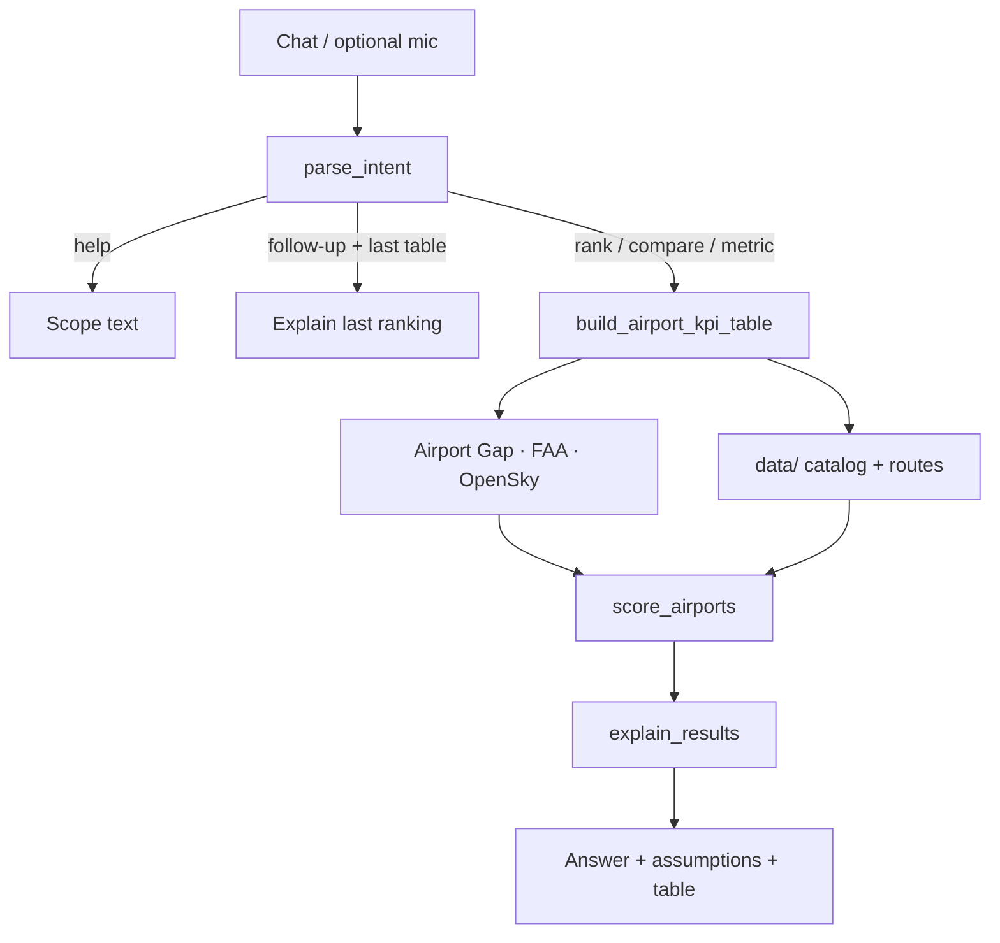
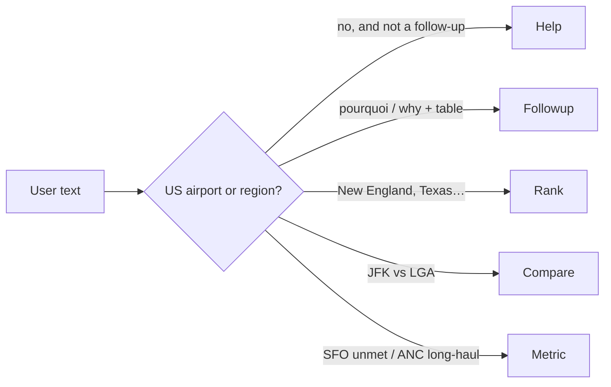

# Design — US Airport Modernization Agent

Screen **US airports** where extra terminal / flight capacity is most likely to be absorbed.

> Relative 0–100 ranking inside the current comparison — **not** an NPV (no capex, fares, or politics).

---

## Scope

| In | Out |
|:---|:---|
| Regional expansion rank | Foreign airports |
| Pairwise congestion compare | “Best airport in the world” |
| Long-haul % (published routes) | Dollar profit / bookings |
| Unmet-demand **proxy** | Silent all-US rank on `which` |
| Follow-up on the last table | Invented statistics |

**Examples**

- Which airports in New England are strong candidates for terminal expansion?
- Compare LA and Santa Ana congestion levels.
- What is the percentage of long-haul flights out of Anchorage?
- What is the unmet flight demand at SFO and why?

---

## Pipeline



| File | Role |
|:---|:---|
| `app.py` | UI, voice, `last_table` |
| `llm_interface.py` | Parse + prose only |
| `data_fetcher.py` | REST + local files |
| `scoring.py` | Deterministic score |
| `regions.py` | US boxes + aliases *(not an API)* |
| `test_scoring.py` | pytest, no key |

---

## Data

**REST (public APIs)**

| | Source | Endpoint | KPI |
|:---:|:---|:---|:---|
| 1 | [Airport Gap](https://airportgap.com) | `GET /api/airports/{IATA}` | identity |
| 2 | [FAA ASWS](https://nasstatus.faa.gov/) | delays + status | congestion / “why” |
| 3 | [OpenSky](https://opensky-network.org) | `states/all` bbox | live aircraft |

**Files in `data/` — datasets, not APIs**

| File | Why it exists |
|:---|:---|
| `us_airports.csv` | Regional catalog (Gap is 1 HTTP / airport) |
| `airport_coords.csv` | Great-circle distance |
| `routes.dat` | Demand + long-haul % |

Cache: static **24 h** · live **5 min**. Live enrich cap **~12** airports (OpenSky rate limits).

---

## Score

Min-max **inside this set**. If everyone is equal on an axis → **0.5**, not a fake 0 or 100.

```text
congestion_raw     = delay_min + 20 × FAA_flag + live_aircraft
unmet_demand_norm  = demand_norm × congestion_norm

investment_score   = 100 × (
                       0.30 demand
                     + 0.30 congestion
                     + 0.25 unmet_demand
                     + 0.15 long_haul
                   )
```

| Weight | KPI | Signal |
|:---:|:---|:---|
| 30% | demand | unique destinations |
| 30% | congestion | FAA delay + OpenSky |
| 25% | unmet_demand | busy **and** constrained |
| 15% | long_haul | % routes ≥ 3000 km |

`reason` is built from the row in Python. The LLM does **not** write the score.

| Caveat | Meaning |
|:---|:---|
| Long-haul % | unique routes, **not** seats or frequencies |
| SFO unmet | **proxy** (no turned-away passenger feed) |

---

## Intents



| Intent | Trigger | Action |
|:---|:---|:---|
| `rank_expansion` | named US region | top-N table |
| `compare` | two+ IATA / aliases | keep every row |
| `airport_metric` | named airport + KPI | tilted weights |
| `followup` | why / pourquoi **and** last table | no new HTTP |
| `help` | `hi`, `which`, no scope | reminder only |

`LA` → LAX · `Santa Ana` → SNA · Claude **or** keyword heuristic.

---

## Where AI is used

| Step | LLM? |
|:---|:---:|
| Fetch APIs + `data/` | no |
| Score / rank / `reason` | **no** |
| Text → intent | optional |
| Explain the table | optional |

`ANTHROPIC_API_KEY` is optional. No key → still ranks.

---

## Stack & tradeoffs

pandas · numpy · requests · Streamlit · anthropic *(optional)* · pytest

| Choice | Instead of |
|:---|:---|
| REST + shipped route files | pretending CSVs are APIs |
| Relative 0–100 | dollar NPV |
| Live cap ~12 | hammering OpenSky |
| Streamlit chat | custom frontend |
| US-only + help on vague Q | ranking all US by default |

**Always shown:** expander, assumptions, fetch warnings. Follow-ups never claim a new live pull.

```bash
pytest test_scoring.py -v
```
